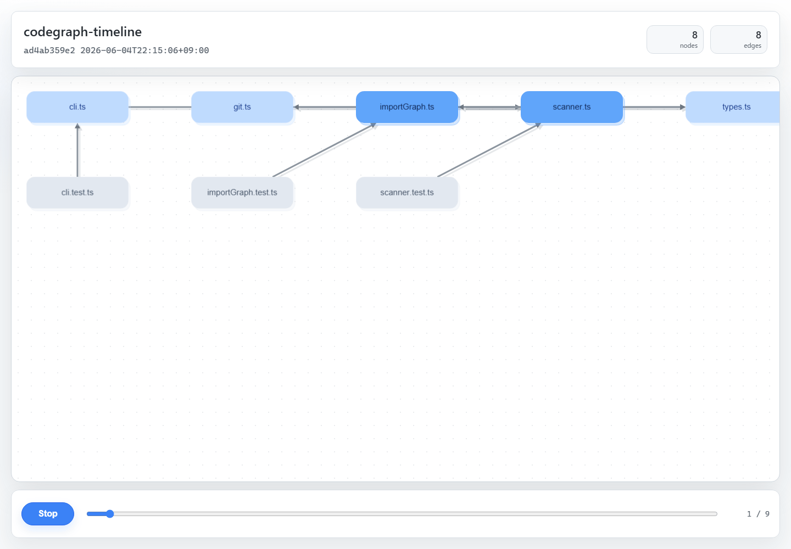

# codegraph-timeline

`codegraph-timeline` is an MVP CLI that scans a Git repository across its first-parent commit history and writes simple import-graph metrics to JSON.

It currently uses regular expressions for TypeScript, JavaScript, and Python import statements. Tree-sitter, richer code graphs, Web UI, and animation are intentionally out of scope for this first version.

## Demo

The Web UI lets you scrub through commit snapshots and inspect the dependency graph over time.



Video: [docs/demo.mp4](docs/demo.mp4)

## Install

```sh
npm install
npm run build
```

## Usage

Run the built CLI directly from this repository:

```sh
node dist/src/cli.js scan <repoPath>
```

On Windows PowerShell, for example:

```powershell
node .\dist\src\cli.js scan C:\Repos\instruction-file-selector
```

If you want to use `codegraph-timeline` as a command name, link the package first:

```sh
npm link
```

Then run:

```sh
codegraph-timeline scan <repoPath>
```

During a scan, the CLI:

1. Reads commits with `git rev-list --first-parent --reverse HEAD`.
2. Adds each selected commit to a temporary Git worktree.
3. Scans TypeScript, JavaScript, and Python files.
4. Resolves local `import` statements into `file -> imported file` edges.
5. Writes timeline snapshots to `data/timeline.json`.
6. Writes module graph snapshots to `data/snapshots/<commit>.json`.

Example:

```sh
codegraph-timeline scan C:\path\to\repo --limit 10
```

Options:

```sh
--limit <count>     Limit scanned commits, starting from the oldest first-parent commit.
--target-dir <dir>  Analyze a directory inside each worktree instead of the repository root.
--output <path>     Write JSON to a custom path. Defaults to data/timeline.json.
```

If PowerShell says `The term 'codegraph-timeline' is not recognized`, the package has not been linked or installed globally yet. Either use the direct `node dist/src/cli.js ...` form, or run `npm link` from this repository.

If Node says `Cannot find module '...\dist\src\cli.js'`, build the TypeScript sources first:

```sh
npm run build
```

Local execution with options:

```sh
node dist/src/cli.js scan <repoPath> --limit 10
```

## Web UI

After scanning a repository, start the local Web UI:

```sh
node dist/src/cli.js serve
```

On Windows PowerShell:

```powershell
node .\dist\src\cli.js serve
```

Then open the URL printed by the command, usually:

```text
http://127.0.0.1:4173
```

The UI reads:

```text
data/timeline.json
data/snapshots/*.json
```

Use the commit slider to switch snapshots. Use the Play/Stop button to step through commits automatically.

Serve options:

```sh
--data-dir <dir>  Directory containing timeline.json and snapshots/. Defaults to data.
--host <host>     Host to bind. Defaults to 127.0.0.1.
--port <port>     Port to bind. Defaults to 4173.
```

The graph view uses Cytoscape.js. To keep the MVP responsive, it displays at most 100 nodes from the selected snapshot and hides edges connected to omitted nodes.

## Output

`data/timeline.json` contains an array of snapshots:

```json
[
  {
    "commit": "abc123...",
    "commitDate": "2026-06-04T12:00:00+09:00",
    "nodeCount": 12,
    "edgeCount": 18,
    "maxInDegree": 4,
    "maxOutDegree": 3,
    "changedFiles": ["src/index.ts"]
  }
]
```

Each commit also gets a module graph snapshot in `data/snapshots/<commit>.json`:

```json
{
  "commit": "abc123...",
  "date": "2026-06-04T12:00:00+09:00",
  "nodes": [
    { "id": "src/index.ts", "label": "index.ts" }
  ],
  "edges": [
    { "source": "src/index.ts", "target": "src/app.ts", "type": "import" }
  ]
}
```

## Development

```sh
npm test
```

The test command builds TypeScript and runs Node's built-in test runner.
